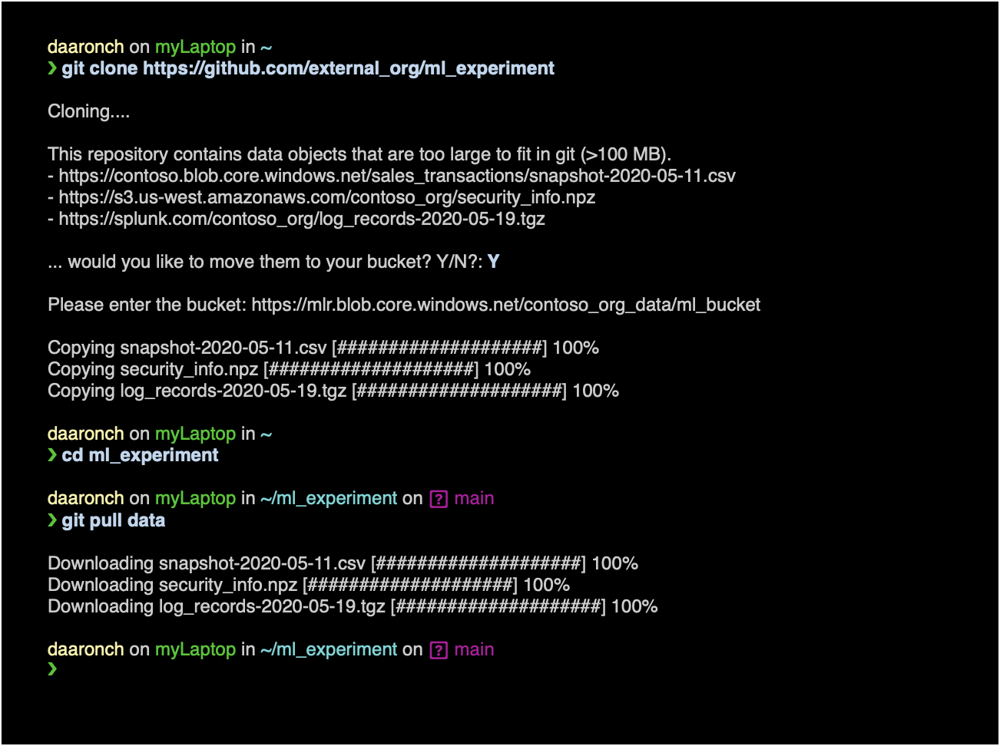
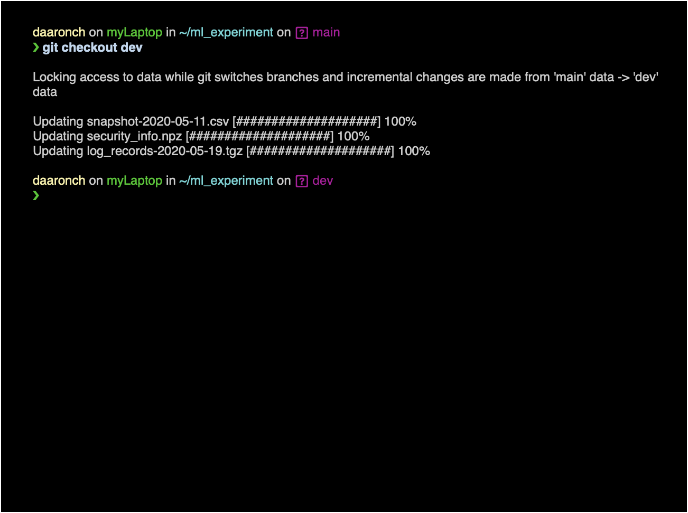
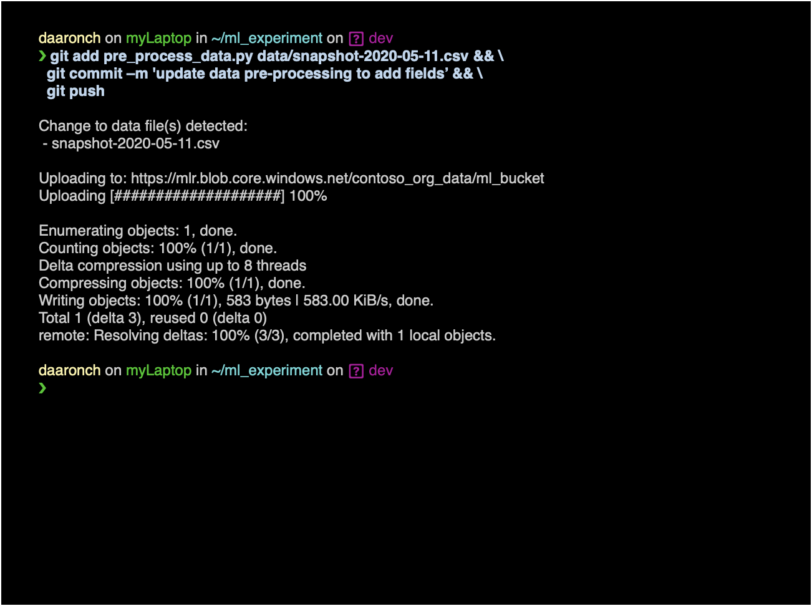
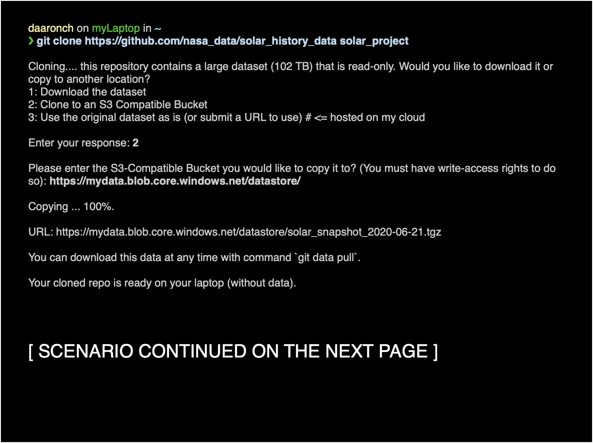
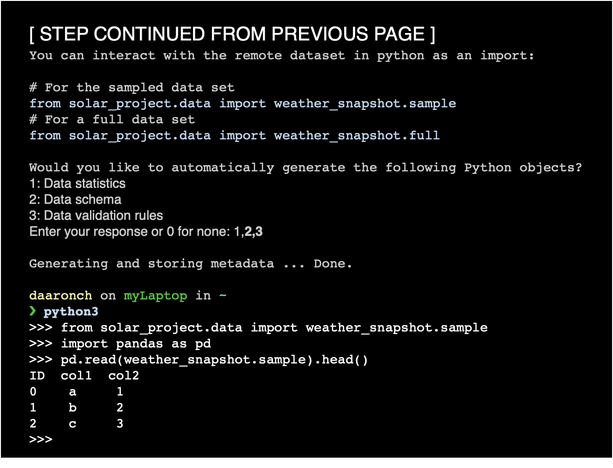
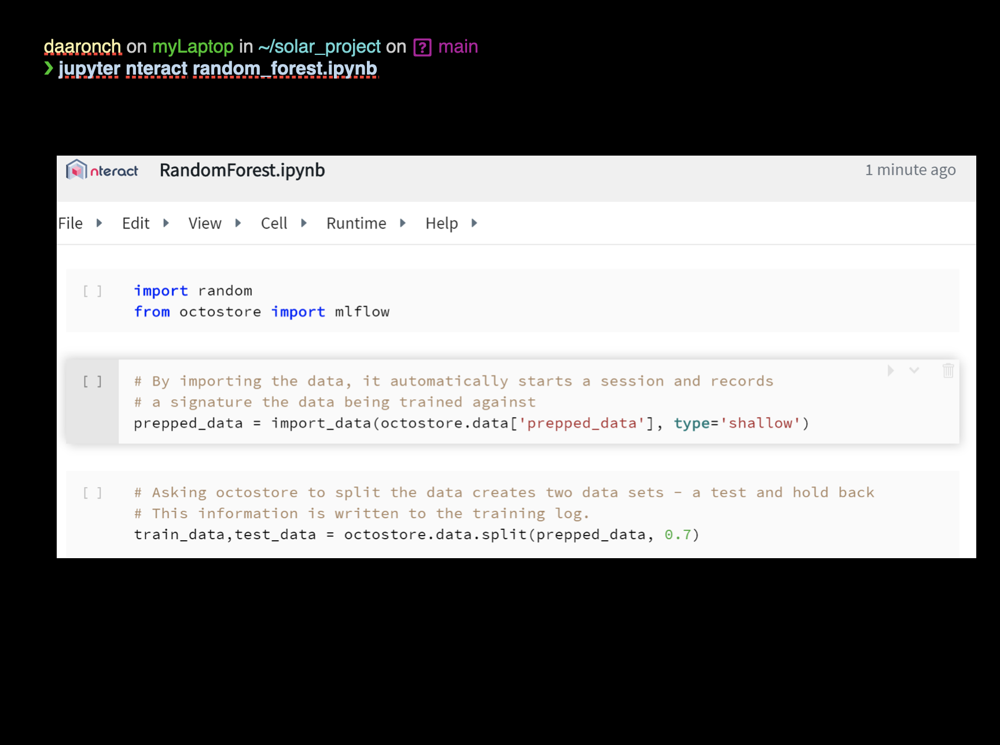
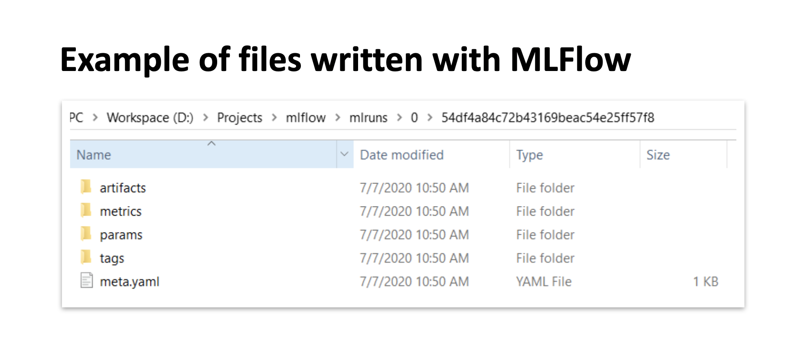
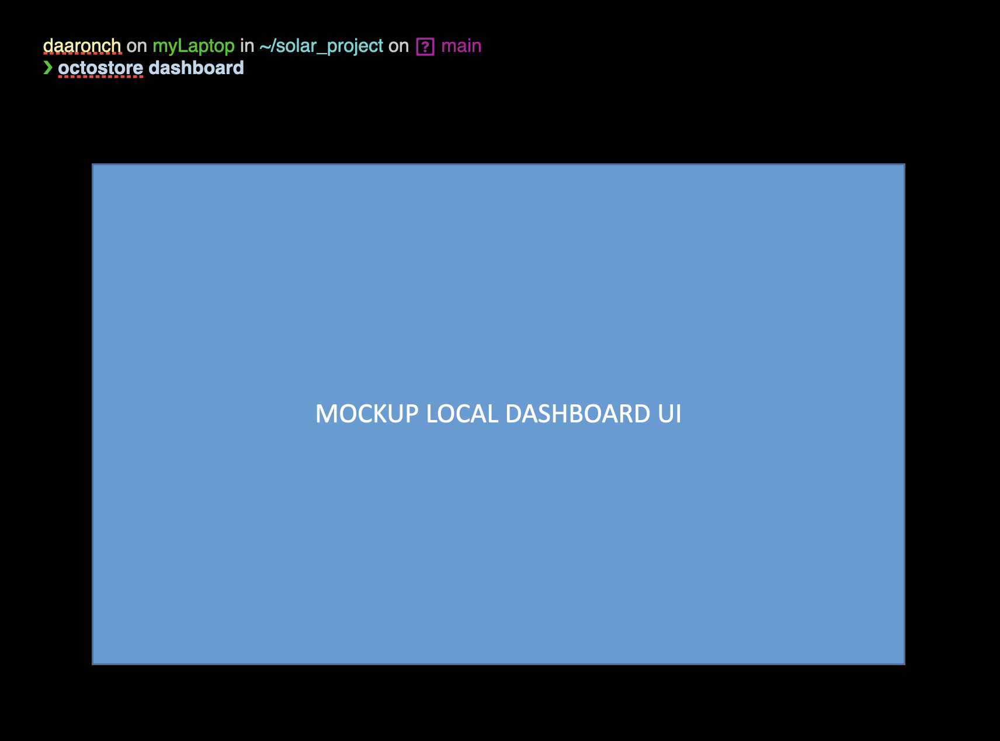
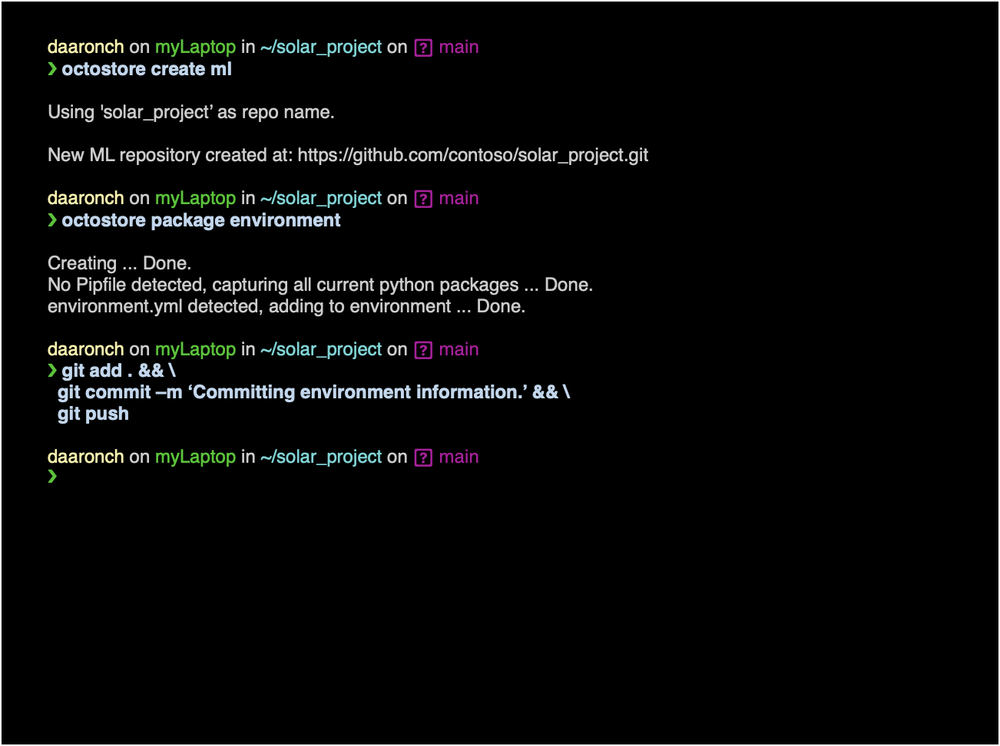
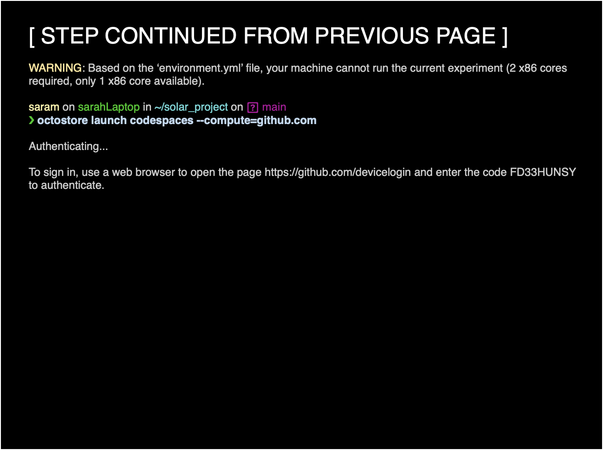

# Scenario 1
The Git Experience but for Data

**Problem Statement**: --- (any time there’s a file in git that’s >25MB, the git process grinds to a halt)

- Developer chooses a repo they want to work with.
    - The repo has code in it but no data
    - The data is hosted on an S3 blob
- The repo contains data, so they download the ‘barcelona_data’ that make data a first class experience in git.
  

- Developer choses to clone the repo.
- At the same time the repo is cloned, it also gives an option to copy the data to a new bucket.
- The developer wants to work with the data locally, so she explicitly pulls down the data, updates any pointers (via shims) so that the scripts still work, but now point at local data
Git could be extended via ‘add-ons’ using a mechanism like this -https://github.com/stevemao/awesome-git-addons
  

- Developer checks out a new branch, and the tool locks and changes the data
- Data is now pointing to branch specific data
  

- Developer wants to visualize data locally
- Uses a built-in library to do so
    - Something like facets (https://pair-code.github.io/facets/ ) would be great
    - Could also generate widgets that appear in the Jupyter Notebook

  

- Developer wants to add an additional file and changes her data.
- Data is automatically ignored by git and pushed to datastore for you as if though you are storing data in GitHub, with the same commands git add and git push.
- All pointers are correctly updated 
    - Would the pointers to the data change? E.g. should it point at a historical commit of the data, instead of just to a file?

  

# Scenario 2
A developer wants to get started with an open data set.
#### Pre-req:
- User already has an account with a cloud that provides an S3-compatible blob store
- User has already installed github_data

#### Steps:
- Developer chooses to start working using an open data set such as satellite data.
- The data set is very large, too large to work with locally.
She doesn’t care what cloud she uses, but she’ll need to make a copy of the dataset – the source files are both remote (meaning training will be slow) and unusable (they’re in tarball format)
- She clones the repo, and it prompts her to select a cloud (or choose her own)

  

#### Steps:
- During the copy, the developer has an option to create multiple types of objects are created:
    - A “sampled” and “full” data set
    - Initialization of a data version
    - Collaboration scaffold (e.g. PR structure)
    - Statistics, schemas and examples
    - DataValidation rules (based on contents)
- Using compute already associated with the project, she runs schema, statistics and example generators (free for <10 GB?)
- Examples of how this works comes from TFX 
    - SchemaGen - https://www.tensorflow.org/tfx/guide/schemagen
    - Schema Gen also auto-grenerates DataValidation rules - https://www.tensorflow.org/tfx/guide/tfdv
    - StatisticsGen - https://www.tensorflow.org/tfx/guide/statsgen
    - ExampleGen - https://www.tensorflow.org/tfx/guide/examplegen
- This generates files that are small enough to use locally for training and improves visualization. It does not require downloading very large data sets.
- The statistics, schemas and examples are all added to the project’s repo automatically. 
  

#### Steps:
- Developer wants to add a second large data set to the existing repo.
She goes to the National Weather Service site (nws) and chooses a snapshot to grab.
- She then adds it to her existing data sources for her project
  

#### Steps:
- Both data sets have been added to the repo, but they’re still too large to download. The developer wants to analyze them, so she issues a command to download the necessary statistics & schemas to her local machine.
- She is able to browse the information and choose relevant features

# Senario 3.0
#### Pre-req:
- Developer wants to use local Jupyter notebook to write and run her training code.
- User has already installed mlflow & github_data
Locally, she’ll use simple APIs to track the experiment. In her current folder

#### Steps:
- Developer starts nteract (a Jupyter UI)
- She imports ‘octostore’, an open source library designed to make interacting with data easy
- She uses octostore to import the data from the source – at this point octostore begins a session and starts recording metadata about her run
- Octostore also has the ability to split data according to common techniques (in this case, 70% training and 30% hold back for testing)
  

#### Steps:
- She’s now ready to do a full training run
- She’s already used MLFlow in the past, and octostore understands the API – so she doesn’t have to change any code.
- She pastes in the code she used from MLFlow and tweaks it as she needs it.
    - Though MLFlow  will “start its own run”, this takes place inside of the larger “octostore” run already kicked off
- The code is now ready to run
- Octostore also can run the file (in the current python environment) and automatically convert (if necessary) the python notebook.
- All information about the run is stored locally in:
<PROJECT_NAME>/
   runs/
      <EXPERIMENT_NAME>/
        <RUN_ID>/
	    [ALL_RUN_FILES]
  

  

#### Steps:
- Developer now wants to evaluate local runs and compare against each other
- The files are written in an MLFlow compliant format so they can be evaluated as well via the MLFlow UI
  

# Scenario 4
A data scientist finishes her local experiments and wants to continue working on another device, or share her experiments with others

#### Pre-req:
- Developer does not have a git repo for the ml project yet, but has already authorized with GitHub
- Developer HAS an environment file, but DOES NOT have a Pipfile (she has been installing python packages using ‘pip’ 
#### Steps:
- To accomplish smooth transition from one working machine to another, a data scientist can easily package his current environment or dependencies
‘octostore create’ command to auto-detect and generate structure (according to cookie-cutter-datascience)
- Additional commands capture the environment and use git to push to the remote repository.

  

# Scenario 5
A second data scientist wants to reproduce the repo locally
#### Pre-req:
- A second developer wants to reproduce the environment cleanly
The repo has already been set up, and she just needs to download and replicate
#### Steps:
- The developer clones the repo locally as normal
- Once inside the repo, she uses ‘octostore’ up to execute the following commands:
    - Detect Pipfile, requirements.txt or other python environment file and create a virtual python environment
    - Detect an environment.yml file and create a conda environment
  

- The environment is cloned, but the developer is warned the requirements of the model do not match the local environment.
- The developer decides to move to codespaces.
  

- The environment is cloned, but the developer is warned the requirements of the model do not match the local environment.
- The developer decides to move to codespaces.
    - QUESTION: How do we do this in a ‘cloud neutral’ way? Other clouds need to be able to participate or we will have limited uptake.

  
