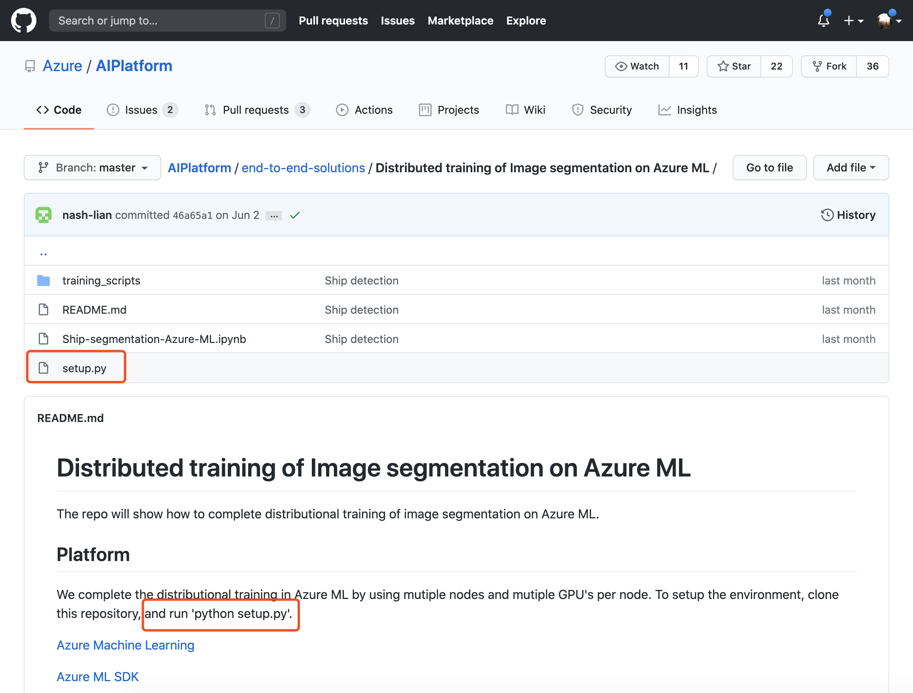
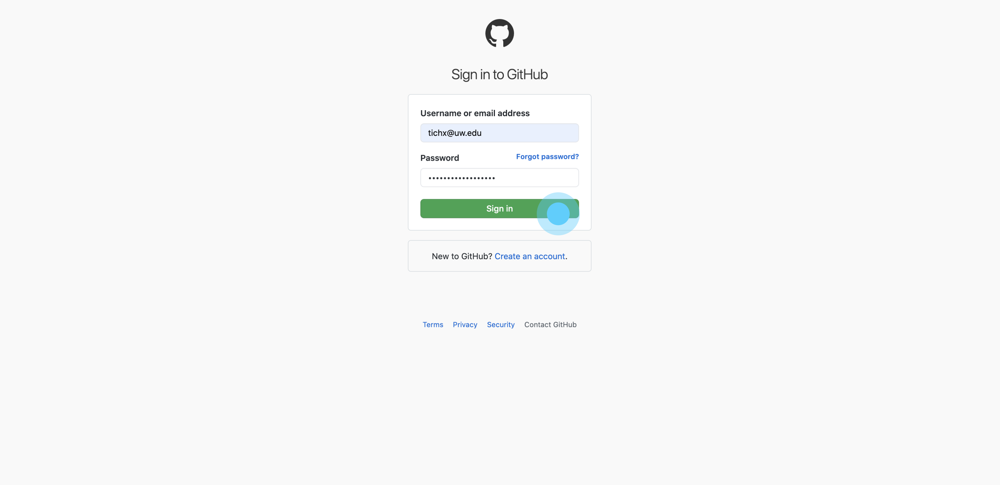
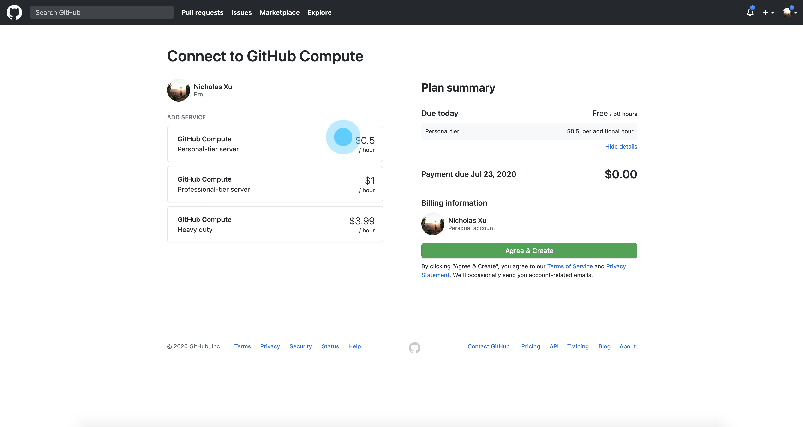
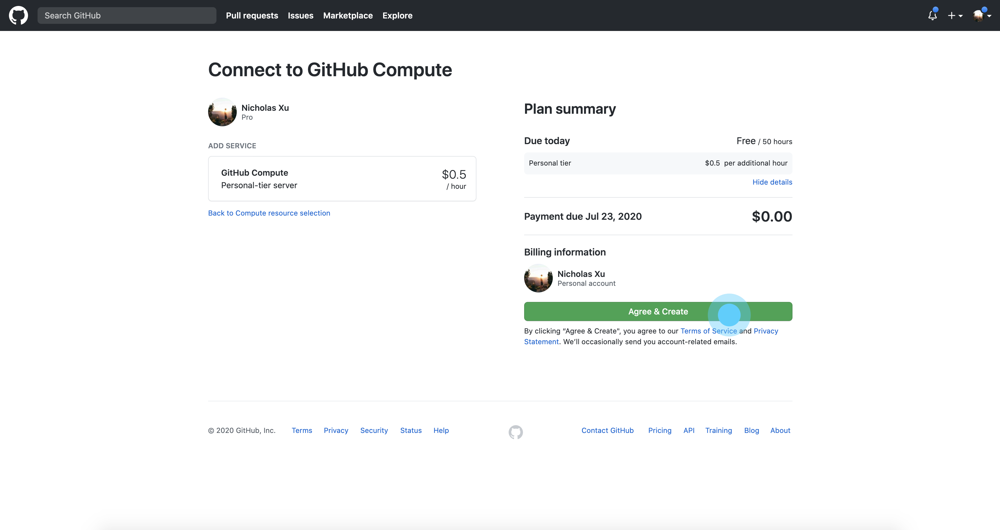
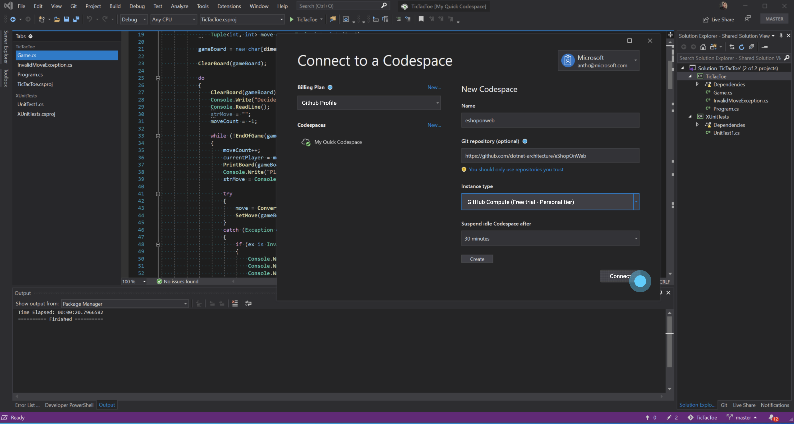
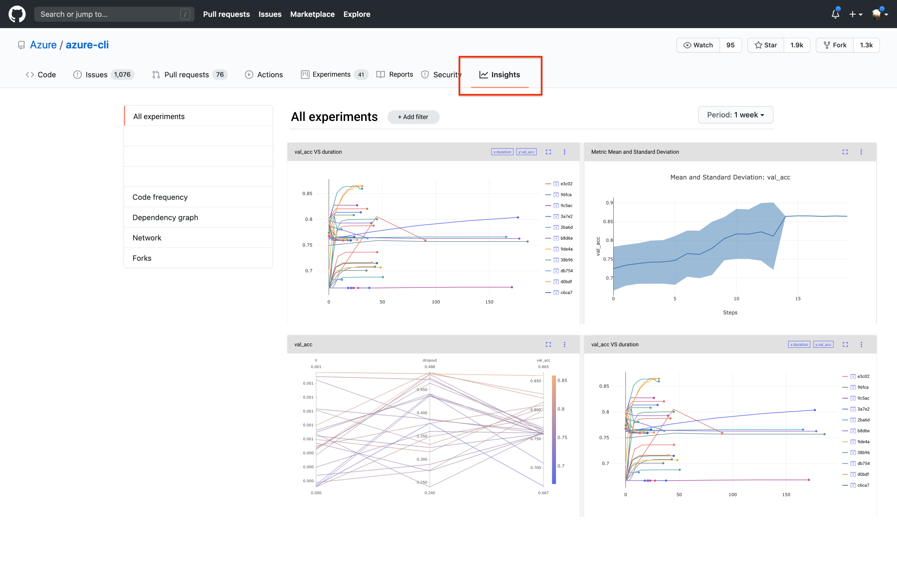
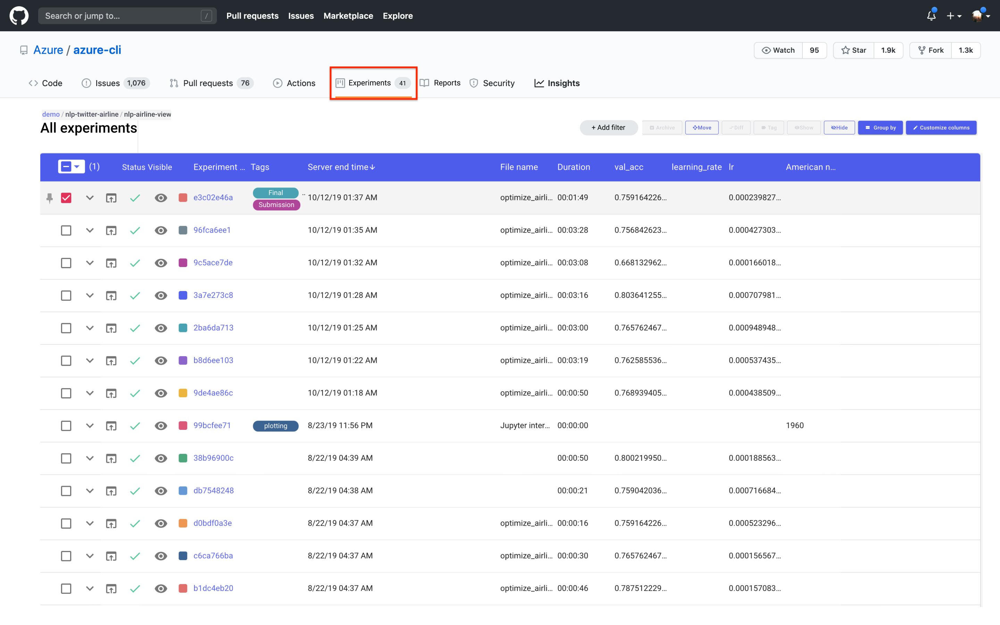
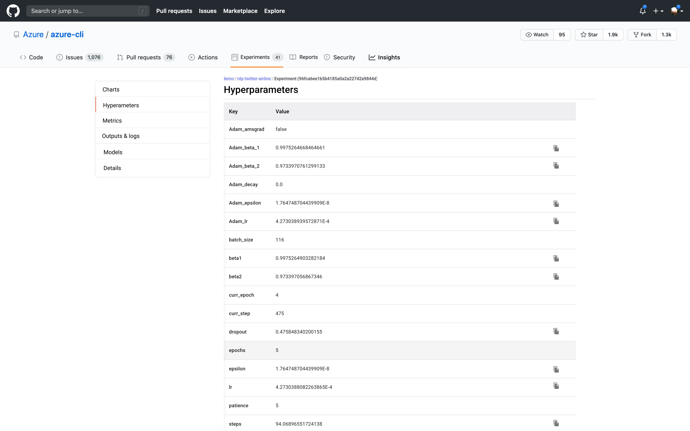

## Senario 1
A data scientist finishes his local experiments and wants to continue working on another new device, or shares his experiments with others.

#### Packaging an environment has never been easier
To accomplish smooth transition from one working machine to another, a data scientist can easily package his current environment or dependencies with ```hub``` command to auto-detect and generate setup files, and then use Git to push to the remote repository.
```bash
# changes to the local machine learning project directory
$ cd dir/to/project/folder

# creates an empty repo, and desinates the repo to be a machine learning type.
$ hub create repo_name -ml

> creating... [\\\\\\\\\\\\\\\\\] 100%
> New ML repository created: git://github.com/YOUR_USER/repo_name.git, done

# scan and generates setup file **
$ hub package-env

Looking for requirements....
Packaging into setup.py.....
    → Success: 'setup.py' generated in /dir/to/current/dir

# lastly, add, commit, and push to GitHub
$ git add .
$ git commit -m "packaged env"
$ git push
```
** During setup compiling, both ```environment.yml``` and ```requirements.txt``` will be generated and packaged into setup.py for simplicity.

EXAMPLE: A simple conda environment file(```environment.yml```):
```yaml
name: end-to-end-solutions
channels: 
    - python
dependencies:
    - python=3.7 # or 2.7
    - numpy=1.9.*
    - pyTorch=2.8
    - tensorflow
    - pip:
        - jtest
```

## Senario 2
A data scientist wants to start working on an existing repo without worrying about environment setup, dependency installations, etc.

#### Re-create a ML repository's environment


The repository owner will use README.md to instruct data scientists to run setup.py file after ```git clone``` .

```bash
$ git clone https://github.com/AIPlatform/end-to-end-solutions.git

> Cloning into `End-to-end solutions`...
> remote: Counting objects: 10, done.
> remote: Compressing objects: 100% (8/8), done.
> remove: Total 10 (delta 1), reused 10 (delta 1)
> Unpacking objects: 100% (10/10), done.

$ cd 'End-to-end solutions'
```
Now, here are a few senarios that data scientists can run into when setting up their local environment.
- **Reuirements met**, auto-setup a new conda envrionment locally
- **Requirements not met**:
    - Move to a Azure compute resource & Codespaces to continue to run the experiment (our value-add)
    - Or, proceed with manual packages installation


With conda:
```bash
$ python setup.py
> locating dependency files...
> checking requirements...
> This repository uses Conda environment, do you want to create a new conda environment? 
> y/n?: y
> Locating enviornment.yml......
> conda nev create -f environment.yml
> Setting up....
> 21 packages installed, done.
$ ~(env-name)$ _
```

With GitHub Compute:
```bash
$ python setup.py
> locating dependency files...
> checking requirements...
> ! ERROR: your machine does not meet the requirements for running (Insufficient CPU: x86 2cores)
> Do you want to setup with GitHub Compute & Codespaces instead? y/n?:y

> Waiting for authentication...
```
Then the user will be prompted to log in at GitHub



Choose an appropriate compute resource. (Ideally, we would recommend an option based on his project. The screen here is only for demo purpose. The pricing details will also be considered on another occasion.)



After an option is selected, the user would then choose 'agree & create' to proceed.



Then the user will be either directed to open a Codespace tab online, or be asked to open Visual Studio on his machine. By clicking 'Connect' he will be able to edit the code and run experiment on the GitHub Compute.



```bash
> Authenticating...
> GitHub logged in...taking to GitHub Compute
> Opening up Visual Studio Codespaces...
> Opening browser....
> Or alternatively, you can open link: https://codespaces.com/editor/tichx/12323asdf3
```

## Senario 3
A data scientist Sarah wants to use her framework of choice to track training, logs, and eventually commits and pushes the repo up to GitHub again for sharing and remote working.
#### Step by step tutorial (Wine quality prediction)
1. After Sarah has set up a working environment as illustrated in Senario 2, she then wants to run some training scripts. In this experiment, she wants to use _random forest_ tree to predict wine quality, and uses __mlflow__ to track the experiment. In her current folder, she has the following items:
   ```
   mlflow/examples/h2o/
      conda.yaml
      random_forest.ipynb
      random_forest.py
      wine-quality.csv
   ```


2. In her training code, she uses __MLflow logging API__ (it could be any popular framworks, metaflow, octostore, etc.) to log metrics and artifacts. 
   

   After finish writing the training code, she runs the entire python script by
   ```
   python random_forest.py
   ```
  

3. The metrics and artifacts are stored in the specific folders under the local project folder ```mlflow/examples/h2o/mlruns/```.


   


4. Sarah then wants to visualize and compare different runs' results on her local dashboard. To do so, she would run in CLI ```mlflow ui``` which will then host an mlflow GUI dashboard at ```http://localhost:5000```.

   
   > Under the "Experiment" tab, she will find 5 runs that she just finished.

5. After several iterations, she's satisfied with the model. Now she wants to push the project into her GitHub repo so that she can continue working on her laptop when she's back to home. 

6. She then uses ```git``` to commit all the changes and pushes to GitHub. 

    ```bash
    $ git add . # or, git add path/to/file
    $ git commit -m "some changes"
    $ git push

    > Enumerating objects: 11, done.
    > Counting objects: 100% (11/11), done.
    > Delta compression using up to 12 threads
    > Compressing objects: 100% (9/9), done.
    > Writing objects: 100% (9/9), 1.89 MiB | 944.00 KiB/s, done.
    > Total 9 (delta 0), reused 0 (delta 0)
    > To https://github.com/tichx/mlworkflow.git
    > d46339e..ac8e73d  master -> master
    ```


7. (Optional) Then, she also wants to share the environment that the code runs in, in which case she will need to package her environment again like Senario 1 and push to GitHub. If the environment has changed, ```hub env-package``` will notify the changes and kindly remind what to be tracked. 

    ```bash

    # scan and generates setup file **
    $ hub package-env 
    > Found 3 environment files modified in /mlruns/
        - 3 changes in /mlruns/artifacts
        - 29383 insertions in /mlruns/experiments
        - 12 deletions in /mlruns/metrics
    > Do you want to package them? y/n: y
    > done.

    # lastly, add, commit, and push to GitHub
    $ git add . 
    $ git commit -m "packaged env"
    $ git push
    ``` 
    In case of forgetting this step, she will also see a reminder on GitHub Action since any commit push is a part of automatic workflow that triggers detection of environment changes.


8. From the GitHub repo, she can see all the previous local run metrics/results from the Insights tab thanks to the environment packaging.
      - Under __Insights__ tab, she will find the highlights of 200 runs tracked by MLflow visualized here for a quick glance.
      
      
      - Then, jumping to __Experiments__, each experiment is shown in the grid. To investigate a specific experiement, she can click on the experiment ID, which will directs her to the deatil page.
      
     
      -  Here, she can customize the charts and find key information about this run.
      
     
      - Also, hyperameters will be documented here with the help of metadata service record.
      
     
      - Additionaly, an output and log page will allows her to see the experinment-specific outputs directly at the repo.
      
     

9. She can also use GitHub actions to trigger a run using the same environment on another compute target (from cloud or on-prem) and visualize results under Insights.