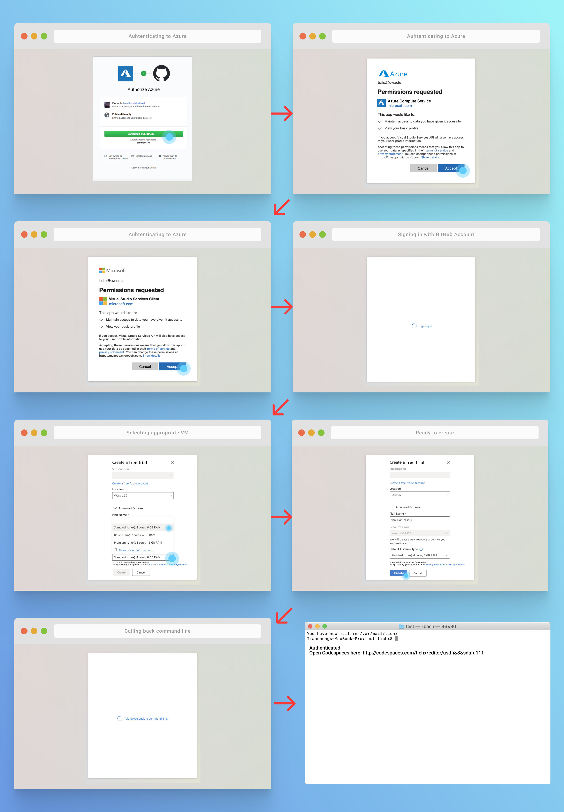

## Senario 1
A data scientist finishes his local experiments and wants to continue working on another new device, or shares his experiments with others.

#### Packaging an environment has never been easier
To accomplish smooth transition from one working machine to another, a data scientist can easily package his current environment or dependencies with ```hub``` command to auto-detect and generate setup files, and then use Git to push to the remote repository.
```bash
# changes to the local machine learning project directory
$ cd dir/to/project/folder

# creates an empty repo, and desinates the repo to be a machine learning type.
$ hub create repo_name -ml

> creating... [\\\\\\\\\\\\\\\\\] 100%
> New ML repository created: git://github.com/YOUR_USER/repo_name.git, done

# scan and generates setup file **
$ hub package-env

Looking for requirements....
Packaging into setup.py.....
    → Success: 'setup.py' generated in /dir/to/current/dir

# lastly, add, commit, and push to GitHub
$ git add .
$ git commit -m "packaged env"
$ git push
```
** During setup compiling, both ```environment.yml``` and ```requirements.txt``` will be generated and packaged into setup.py for simplicity.

EXAMPLE: A simple conda environment file(```environment.yml```):
```yaml
name: end-to-end-solutions
channels: 
    - python
dependencies:
    - python=3.7 # or 2.7
    - numpy=1.9.*
    - pyTorch=2.8
    - tensorflow
    - pip:
        - jtest
```

## Senario 2
A data scientist wants to start working on an existing repo without worrying about environment setup, dependency installations, etc.

#### Re-create a ML repository's environment


The repository owner will use README.md to instruct data scientists to run setup.py file after ```git clone``` .

```bash
$ git clone https://github.com/AIPlatform/end-to-end-solutions.git

> Cloning into `End-to-end solutions`...
> remote: Counting objects: 10, done.
> remote: Compressing objects: 100% (8/8), done.
> remove: Total 10 (delta 1), reused 10 (delta 1)
> Unpacking objects: 100% (10/10), done.

$ cd 'End-to-end solutions'
```
Now, here are a few senarios that data scientists can run into when setting up their local environment.
- **Reuirements met**, auto-setup a new conda envrionment locally
- **Requirements not met**:
    - Move to a Azure compute resource & Codespaces to continue to run the experiment (our value-add)
    - Or, proceed with manual packages installation


With conda:
```bash
$ python setup.py
> locating dependency files...
> checking requirements...
> This repository uses Conda environment, do you want to create a new conda environment? 
> y/n?: y
> Locating enviornment.yml......
> conda nev create -f environment.yml
> Setting up....
> 21 packages installed, done.
$ ~(env-name)$ _
```

With Azure:
```bash
$ python setup.py
> locating dependency files...
> checking requirements...
> ! ERROR: your machine does not meet the requirements for running (Insufficient CPU: x86 2cores)
> Do you want to setup with Azure VM & Codespaces instead? y/n?:y

> Waiting for authentication...
```

```bash
> Authenticating...
> Azure connected.
> Visual Studio Codespaces connected.
> Taking you to Visual Studio Codespaces....opening browser
> Or alternatively, you can open link: https://codespaces.com/editor/tichx/12323asdf3
```
